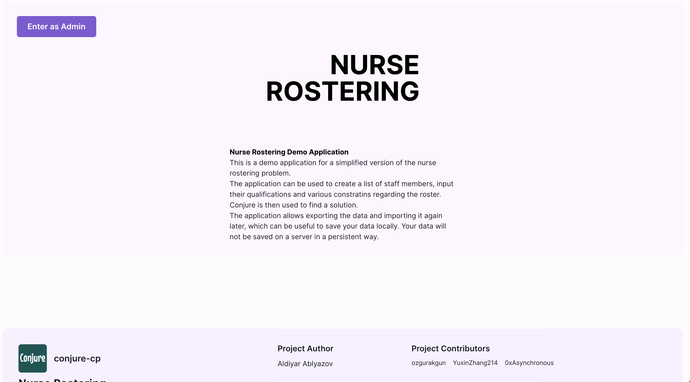
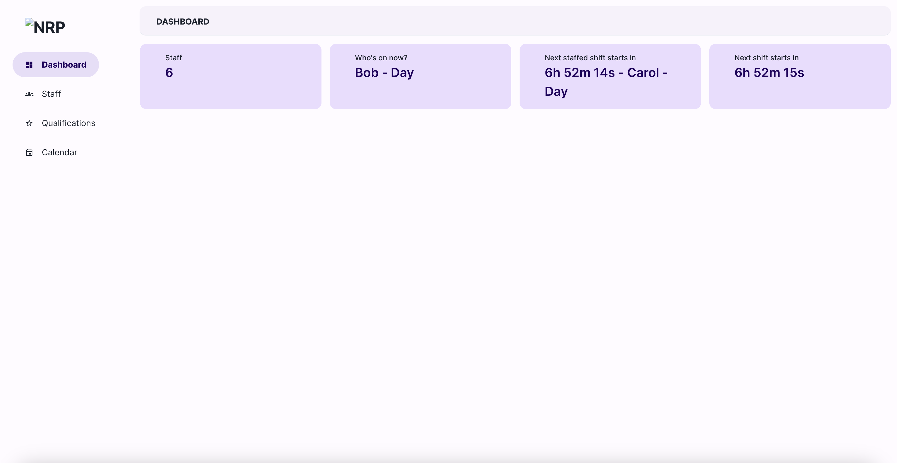
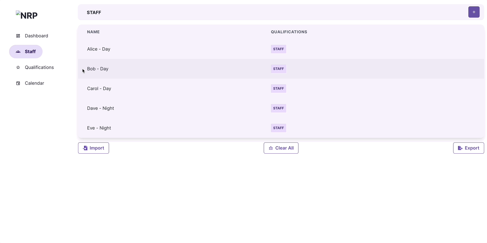
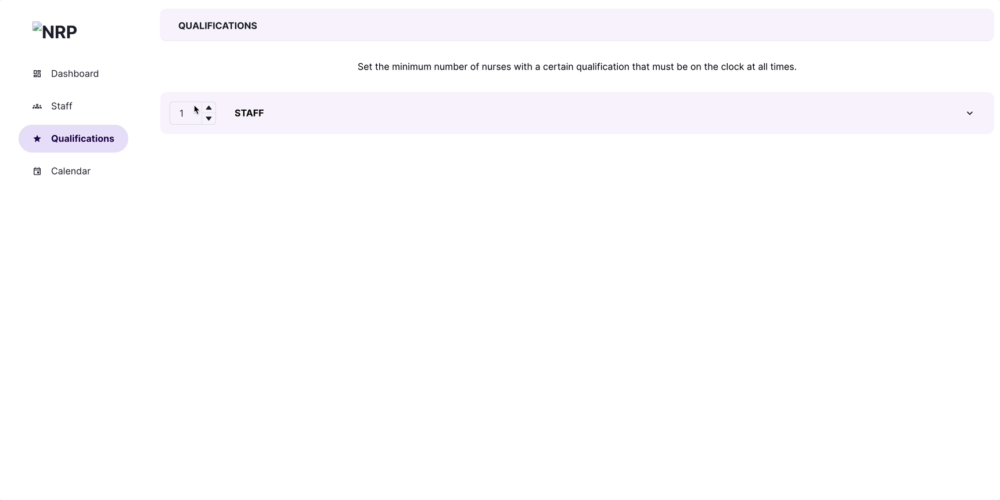

## Getting Started

First, install the dependencies:

```bash
yarn install
#or
npm install
```

Then, run the development server:

```bash
yarn dev
# or
npm run dev
```

Open [http://localhost:3000](http://localhost:3000) with your browser to see the result.


## User Interface

Below are some screenshots of the project UI:

### Home Page



This is the **homepage**

### Dashboard



This is the dashboard showing the scheduling

## Example Screenshots

### Create staff



Create staff **Frank**, who preferred night shifts

### Set qualification


Set the at least **1 staff** that must be on the clock at all times.

### Schedule



Schedule and get the timetable

## License

This project is licensed under the Mozilla Public License 2.0. For full license information, please see the [LICENSE](./LICENSE) file in the repository.